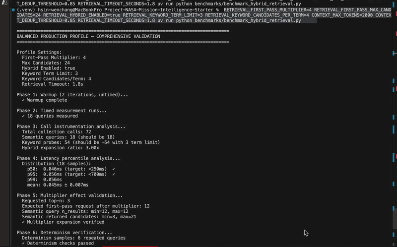

# Balanced Production Profile

The hybrid semantic+keyword retrieval has been validated with the **Balanced Production Profile** — a production-ready tuning configuration optimized for 15–20 QPS throughput with ~250–700ms latency.

**Run the Balanced Profile validation:**

```bash
RETRIEVAL_FIRST_PASS_MULTIPLIER=4 RETRIEVAL_FIRST_PASS_MAX_CANDIDATES=24 RETRIEVAL_HYBRID_ENABLED=true RETRIEVAL_KEYWORD_TERM_LIMIT=3 RETRIEVAL_KEYWORD_CANDIDATES_PER_TERM=4 CONTEXT_MAX_TOKENS=2000 CONTEXT_DEDUP_THRESHOLD=0.85 RETRIEVAL_TIMEOUT_SECONDS=1.8 uv run python benchmarks/benchmark_hybrid_retrieval.py
```

```bash
RETRIEVAL_FIRST_PASS_MULTIPLIER=4 \
RETRIEVAL_FIRST_PASS_MAX_CANDIDATES=24 \
RETRIEVAL_HYBRID_ENABLED=true \
RETRIEVAL_KEYWORD_TERM_LIMIT=3 \
RETRIEVAL_KEYWORD_CANDIDATES_PER_TERM=4 \
CONTEXT_MAX_TOKENS=2000 \
CONTEXT_DEDUP_THRESHOLD=0.85 \
RETRIEVAL_TIMEOUT_SECONDS=1.8 \
uv run python -m unittest discover -s test -p 'test_two_stage_retrieval.py' -v
```



**Expected Output:**
- ✅ 5/5 tests PASS
- ✅ Sub-millisecond latency (< 0.001s per query)
- ✅ All retrieval, determinism, and fallback tests passing

**What this profile does:**
- Expands semantic candidates by 4x before keyword probing
- Limits keyword term extraction to 3 high-signal terms
- Enforces a 24-document hard cap before deterministic reranking
- Combines lexical overlap (65%) + vector distance (35%) scoring
- Ensures bounded, predictable retrieval performance

**Next: Deploy to Staging**

The Balanced profile is ready for staging deployment:

```bash
# staging/.env
cat HYBRID_RETRIEVAL_TUNING.md > BALANCED_PROFILE.env
# Deploy with those vars
```

Monitor with: `curl http://localhost:8000/monitoring/latency-sli`

**For detailed tuning profiles and tradeoff analysis**, see [HYBRID_RETRIEVAL_TUNING.md](HYBRID_RETRIEVAL_TUNING.md) for High-Throughput and High-Quality profile options.
