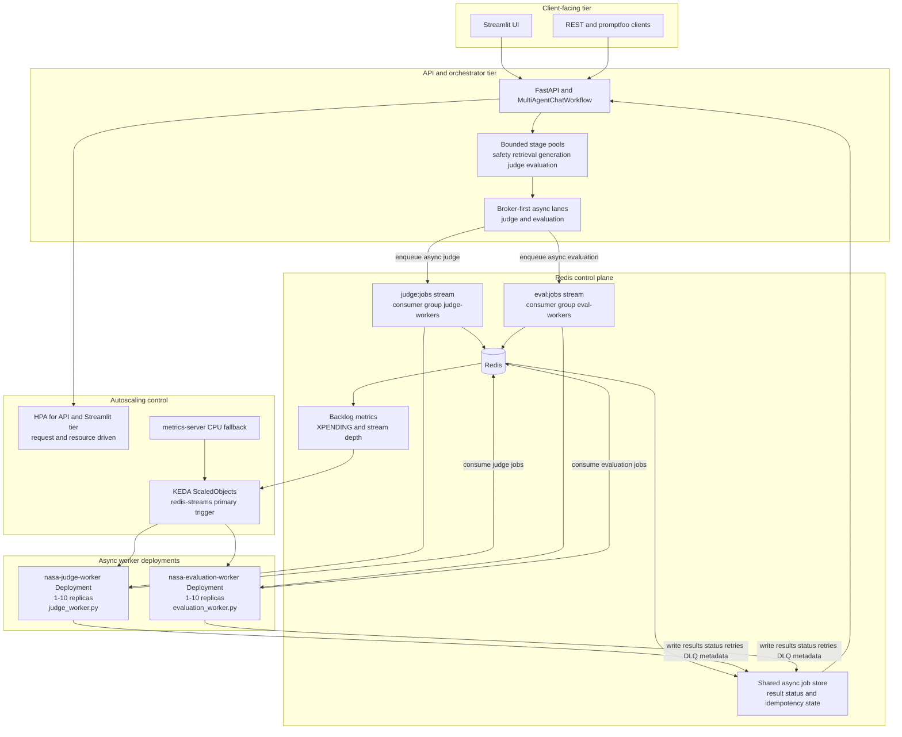

# Kubernetes Evaluation and Judge Worker Setup with KEDA Autoscaling

This document is the deep-dive reference for architecture, scaling behavior, and operational diagnostics.
For the concise enablement runbook (production-parity commands, required flags, and quick checks),
see [Broker-Backed Evaluation and Judge Workers on Kubernetes](k8s-broker-backed-eval-judge-workers.md).

## Overview

The async worker subsystem provides asynchronous task processing for evaluation and judge jobs. It uses:

- **Redis Streams** as persistent job brokers (`eval:jobs` and `judge:jobs` streams)
- **KEDA** for horizontal pod autoscaling based on job backlog depth
- **metrics-server** for CPU-based fallback scaling

This document describes the setup, configuration, and operational behavior.

## Architecture



## Prerequisites

| Component | Version | Requirement |
|-----------|---------|-------------|
| Kubernetes | 1.20+ | Any distribution (k8s, Minikube, EKS, AKS) |
| KEDA | 2.13+ | For redis-streams scaler support |
| Helm | 3.0+ | For KEDA package management |
| kubectl | 1.20+ | Cluster access and manifest application |
| metrics-server | 0.6+ | CPU-based scaling fallback |

## Automated Setup

### Quick Start

If you only need the standard enablement path, use
[Broker-Backed Evaluation and Judge Workers on Kubernetes](k8s-broker-backed-eval-judge-workers.md).
Use the commands below when you need the same setup with additional implementation context.

For production-parity with evaluation and judge workers enabled:

```bash
export ENABLE_EVALUATION_WORKER=true
export ENABLE_JUDGE_WORKER=true
export ENABLE_KEDA=true
export ENABLE_METRICS_SERVER=true
export ENABLE_WORKER_RELIABILITY_ALERTS=true

./scripts/setup-k8s-production-parity.sh
```

This script will automatically:

1. **Install metrics-server** (if `ENABLE_METRICS_SERVER=true`)
   - Checks if already installed
   - On Minikube: enables via addon
   - On other clusters: requires manual pre-installation

2. **Install KEDA** (if `ENABLE_KEDA=true` or `ENABLE_EVALUATION_WORKER=true`)
   - Adds Helm repo: https://kedacore.github.io/charts
   - Creates `keda` namespace
   - Deploys KEDA operator via Helm

3. **Provision Redis** (if either worker is enabled and `REDIS_HOST` not specified)
   - Creates PVC for data durability
   - Deploys Redis 7.2-alpine with AOF persistence
   - Waits for ready state

4. **Deploy worker tiers** and **ScaledObjects**
  - Rolls out NASA evaluation worker deployment
  - Rolls out NASA judge worker deployment
  - Applies KEDA ScaledObjects for autoscaling triggers

### Environment Variables

```bash
# Scaling control
ENABLE_EVALUATION_WORKER=true        # Deploy evaluation workers and Redis
ENABLE_JUDGE_WORKER=true             # Deploy judge workers and Redis
ENABLE_KEDA=true                     # Install KEDA operator
ENABLE_METRICS_SERVER=true           # Install metrics-server (Minikube only)
ENABLE_WORKER_RELIABILITY_ALERTS=true # Apply worker reliability PrometheusRule (default true)

# Redis configuration
REDIS_HOST="nasa-redis"              # Default: in-cluster (nasa-redis.default.svc.cluster.local)
REDIS_PORT=6379                      # Redis port
REDIS_DB=0                           # Database index
REDIS_PASSWORD=""                    # Leave empty for in-cluster Redis

# KEDA configuration
KEDA_NAMESPACE="keda"                # Namespace for KEDA operator
KEDA_HELM_REPO="https://kedacore.github.io/charts"  # Helm chart source

# Other
APP_NAMESPACE="default"              # Where to deploy workers
```

## Scaling Behavior

### Scaling Triggers

Each KEDA ScaledObject (`keda-scaledobject-evaluation-worker.yaml` and `keda-scaledobject-judge-worker.yaml`) defines two independent triggers:

#### 1. Redis Streams Backlog (Primary)

```yaml
- type: redis-streams
  metadata:
    address: "nasa-redis.default.svc.cluster.local:6379"
    stream: "eval:jobs"
    consumerGroup: "eval-workers"
    pendingEntriesCount: "5"
```

**Behavior:**
- Measures `XPENDING` count on `eval:jobs` stream for `eval-workers` group
- Scales up when pending entries per replica exceed 5
- Formula: `desired_replicas = ceil(pending_entries / 5)`
- Min: 1, Max: 10 replicas

**When to adjust:**
- Increase `pendingEntriesCount` if workers are under-utilized (e.g., → 10)
- Decrease if you want more aggressive scaling (e.g., → 2)

#### 2. CPU Utilization (Fallback)

```yaml
- type: cpu
  metricType: Utilization
  metadata:
    value: "75"
```

**Behavior:**
- Falls back to CPU-based scaling if redis-streams metric unavailable
- Scales up when any worker hits 75% CPU
- Prevents starvation during sustained traffic spike

**When to adjust:**
- Increase threshold (e.g., → 85%) to allow higher peak CPU before scaling
- Decrease (e.g., → 50%) for earlier scale-up response

### Scale-Down Stabilization

KEDA applies a 5-minute cooldown before scaling down to prevent thrashing. After jobs complete:
- Pending count drops → scale-down recommendation issued
- 5-minute window passes → replicas terminated
- Workers gracefully drain remaining jobs (60s termination grace period)

### Monitoring

Check current scaling state:

```bash
# View HPA generated by KEDA
kubectl get hpa -n default
kubectl describe hpa keda-hpa-nasa-evaluation-worker-scaler -n default

# View pending evaluation jobs
kubectl exec -it deployment/nasa-redis -c redis -- redis-cli \
  XPENDING eval:jobs eval-workers

# View pending judge jobs
kubectl exec -it deployment/nasa-redis -c redis -- redis-cli \
  XPENDING judge:jobs judge-workers

# View worker replica count
kubectl get deploy nasa-evaluation-worker -o wide
kubectl get deploy nasa-judge-worker -o wide
```

## Manual Setup (Alternative)

If automation is disabled, install components manually:

### 1. Install metrics-server

**On Minikube:**
```bash
minikube addons enable metrics-server
minikube kubectl -- wait --for=condition=available \
  --timeout=180s -n kube-system deployment/metrics-server
```

**On other clusters:**
```bash
# Check if already installed
kubectl get apiservice v1beta1.metrics.k8s.io

# If not, install via your cluster provider
# (e.g., EKS: metrics-server is pre-installed)
# (e.g., AKS: use `az aks enable-addons --resource-group <rg> --name <cluster> --addons monitoring`)
```

### 2. Install KEDA

```bash
helm repo add kedacore https://kedacore.github.io/charts
helm repo update kedacore

helm upgrade --install keda kedacore/keda \
  --namespace keda \
  --create-namespace \
  --wait \
  --timeout=180s
```

### 3. Deploy Redis

```bash
kubectl apply -f deploy/k8s/redis-deployment.yaml
kubectl wait --for=condition=ready pod \
  -l app.kubernetes.io/name=nasa-redis \
  --timeout=180s -n default
```

### 4. Deploy Evaluation and Judge Workers

```bash
kubectl apply -f deploy/k8s/evaluation-worker-deployment.yaml
kubectl apply -f deploy/k8s/keda-scaledobject-evaluation-worker.yaml
kubectl apply -f deploy/k8s/judge-worker-deployment.yaml
kubectl apply -f deploy/k8s/keda-scaledobject-judge-worker.yaml

kubectl wait --for=condition=ready pod \
  -l app.kubernetes.io/name=nasa-evaluation-worker \
  --timeout=180s -n default
kubectl wait --for=condition=ready pod \
  -l app.kubernetes.io/name=nasa-judge-worker \
  --timeout=180s -n default
```

## Troubleshooting

### No Scaling Happening

**Symptoms:**
- Replica count stays at initial value
- XPENDING count increases but workers don't scale up

**Diagnosis:**
```bash
# Check KEDA ScaledObject status
kubectl describe scaledobject nasa-evaluation-worker-scaler -n default

# Check HPA conditions
kubectl describe hpa keda-hpa-nasa-evaluation-worker-scaler -n default

# Check metrics availability
kubectl top nodes  # Verify metrics-server is providing data
```

**Solutions:**
- Verify metrics-server is running: `kubectl get deploy -n kube-system metrics-server`
- Verify Redis connectivity: `kubectl logs -l app.kubernetes.io/name=nasa-evaluation-worker`
- Check KEDA operator logs: `kubectl logs -n keda deploy/keda-operator`

### Workers Crashing

**Symptoms:**
- Pods in CrashLoopBackOff state
- Logs show Redis connection failures

**Diagnosis:**
```bash
kubectl logs -l app.kubernetes.io/name=nasa-evaluation-worker -f
```

**Solutions:**
- Verify Redis is running: `kubectl get pod -l app.kubernetes.io/name=nasa-redis`
- Check Redis logs: `kubectl logs -l app.kubernetes.io/name=nasa-redis`
- Verify DNS resolution: `kubectl exec -it <worker-pod> -- nslookup nasa-redis.default.svc.cluster.local`

### Scaling Too Aggressive

**Symptoms:**
- Workers scaling up/down rapidly (thrashing)
- Resource waste from constant pod creation/termination

**Solutions:**
- Increase `pendingEntriesCount` in ScaledObject (e.g., 5 → 10)
- Monitor with: `kubectl get hpa -w` and watch replica changes over time

## Production Considerations

### High Availability

**Current deployment:**
- Single-replica Redis with PVC durability
- Suitable for: dev, staging, small clusters with modest evaluation throughput
- Recovery: brief service loss on pod/node failure, data recoverable from PVC

**Upgrade path for HA:**
- Use AWS ElastiCache, Azure Cache for Redis, or Google Memorystore
- Set `REDIS_HOST` to external endpoint
- Ensures zero-downtime Redis failover
- Recommended for production with strict uptime requirements

### Resource Limits

Edit `keda-scaledobject-evaluation-worker.yaml` to adjust:
- `maxReplicaCount: 10` → cluster-dependent max
- `pendingEntriesCount: 5` → throughput-dependent sweet spot

For high-throughput environments:
```yaml
spec:
  minReplicaCount: 5        # Keep warm pool to avoid cold start
  maxReplicaCount: 50       # Allow more aggressive scale-up
  triggers:
  - type: redis-streams
    metadata:
      pendingEntriesCount: "10"  # More relaxed per-replica ratio
```

### Monitoring & Alerting

Recommended metrics to track:
- `keda_scaler_active` - Is KEDA scaler running?
- `keda_scaler_metrics_value` - Current metric value (pending entries)
- `keda_scaler_metrics_desired_replicas` - Computed desired replica count
- Pod restart count - Indicates worker stability issues

Example Prometheus queries:
```promql
# Current pending jobs
redis_xpending_eval_jobs_eval_workers

# Evaluation worker replica count
kubernetes_pod_count{label_app_kubernetes_io_name="nasa-evaluation-worker"}

# Worker CPU utilization
rate(container_cpu_usage_seconds_total{pod=~"nasa-evaluation-worker-.*"}[5m])
```

## FAQ

**Q: Can I use external Redis instead of in-cluster?**  
A: Yes. Set `REDIS_HOST=<external-redis-host>` before running setup. The script will skip in-cluster Redis provisioning.

**Q: Does KEDA require a dedicated namespace?**  
A: Yes, KEDA operator runs in its own namespace (default: `keda`). Workers run in `default` namespace.

**Q: What happens if Redis is unavailable?**  
A: KEDA falls back to CPU-based scaling. Workers will fail to consume jobs, but HPA won't scale them down based on empty backlog.

**Q: Can I scale manually while KEDA is active?**  
A: Yes, but KEDA will overwrite your manual replica count within its sync interval (~15s).

**Q: Is metrics-server required?**  
A: For CPU-based fallback, yes. For redis-streams-only scaling, no. Recommended for production.

## Related Files

- [redis-deployment.yaml](../deploy/k8s/redis-deployment.yaml) - In-cluster Redis with PVC
- [evaluation-worker-deployment.yaml](../deploy/k8s/evaluation-worker-deployment.yaml) - Worker pods
- [keda-scaledobject-evaluation-worker.yaml](../deploy/k8s/keda-scaledobject-evaluation-worker.yaml) - KEDA scaling config
- [setup-k8s-production-parity.sh](../scripts/setup-k8s-production-parity.sh) - Automated setup
