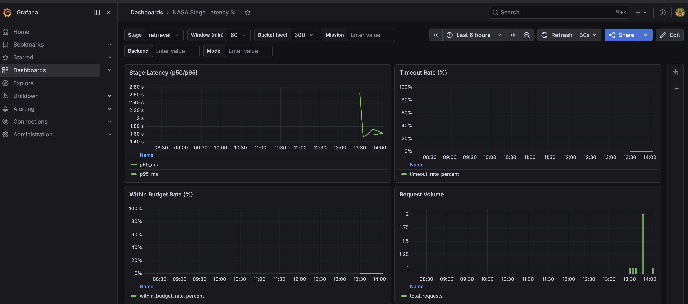

# Latency SLI Usage

1. Start API locally, or use the Kubernetes API via port-forward:
   ```bash
   uv run uvicorn api_server:app --host 0.0.0.0 --port 8000
   ```
   Or, if you are using the Kubernetes deployment:
   ```bash
   kubectl port-forward -n default svc/nasa-mission-intelligence-streamlit 8501:8501

   kubectl port-forward deploy/nasa-mission-intelligence-api 8000:8000 -n default
   ```
2. Start Grafana (Docker with Infinity plugin):
   ```bash
   docker run -d --name nasa-grafana -p 3000:3000 \
     -e GF_SECURITY_ADMIN_USER=admin \
     -e GF_SECURITY_ADMIN_PASSWORD=admin \
     -e GF_INSTALL_PLUGINS=yesoreyeram-infinity-datasource \
     grafana/grafana:latest
   ```
   Or, if you are using the in-cluster `kube-prometheus-stack` Grafana, port-forward it instead:
   ```bash
   # Run in a separate terminal to keep port-forward alive
   kubectl -n monitoring port-forward svc/kube-prometheus-stack-grafana 33000:80
   ```
   This exposes the in-cluster Grafana on `http://127.0.0.1:33000`.
   The setup automation now installs the Infinity plugin and provisions an Infinity datasource automatically in kube-prometheus-stack Grafana.
   Fetch current Grafana credentials from the secret instead of assuming static defaults:
   ```bash
   kubectl get secret -n monitoring kube-prometheus-stack-grafana -o jsonpath='{.data.admin-user}' | base64 --decode; echo
   kubectl get secret -n monitoring kube-prometheus-stack-grafana -o jsonpath='{.data.admin-password}' | base64 --decode; echo
   ```
3. Import dashboard:
   - Open `http://127.0.0.1:3000` (Docker) or `http://127.0.0.1:33000` (in-cluster) and sign in
   - Go to Dashboards -> Import
   - Upload [monitoring/latency_sli_dashboard.json](../monitoring/latency_sli_dashboard.json)
   - Map `DS_INFINITY` to your Infinity datasource

   Pull-safe one-command import (auto-detects Infinity datasource UID, binds `api_base_url`, and verifies endpoint query):

   ```bash
   GRAFANA_URL=http://127.0.0.1:3000 GRAFANA_USER=admin GRAFANA_PASSWORD=admin API_BASE_URL=http://127.0.0.1:8000 ./scripts/import-grafana-stage-latency-dashboard.sh
   ```
   For in-cluster Grafana, bind the dashboard to the Kubernetes service DNS name and keep local verification on the port-forward:
   ```bash
   GRAFANA_URL=http://127.0.0.1:33000 API_BASE_URL=http://nasa-mission-intelligence-api.default.svc.cluster.local:8000 VERIFY_API_BASE_URL=http://127.0.0.1:18000 ./scripts/import-grafana-stage-latency-dashboard.sh
   ```
4. Verify data endpoint and first chart render:
   ```bash
   curl "http://127.0.0.1:8000/monitoring/latency-sli/timeseries?stage=retrieval&window_minutes=60&bucket_seconds=300"
   ```
   - Confirm `series` is not empty in the curl response.
   - In Grafana, open "NASA Stage Latency SLI" and confirm "Stage Latency (p50/p95)" shows lines.

## Demonstration


