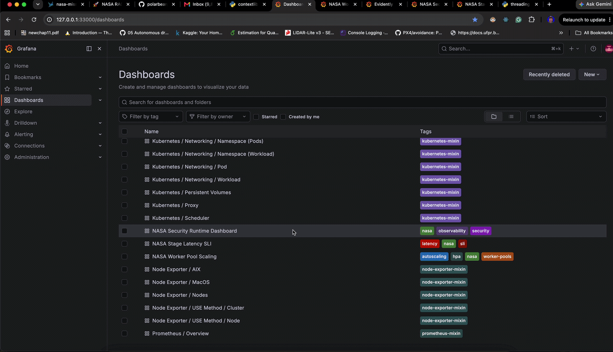

# Security Observability (Prometheus + Grafana)

This project now exports dedicated security metrics at `/monitoring/security/prometheus` and includes reusable Grafana assets for dashboarding and alerting.

## Kubernetes scrape + provisioning

1. Apply both ServiceMonitors (worker pools + security metrics):

   ```bash
   kubectl apply -f deploy/k8s/servicemonitor-worker-pools.yaml
   kubectl apply -f deploy/k8s/servicemonitor-security-metrics.yaml
   ```

2. Provision Grafana assets from the source files:

   ```bash
   ./scripts/provision-grafana-security-assets.sh
   ```

   Source files:
   - [monitoring/grafana/security_dashboard.json](../monitoring/grafana/security_dashboard.json)
   - [monitoring/grafana/security_alert_rules.yaml](../monitoring/grafana/security_alert_rules.yaml)

   For local/non-provisioned Grafana instances (for example `http://127.0.0.1:3000`), use the pull-safe helper that auto-detects the local Prometheus datasource UID and verifies panel queries:

   ```bash
   GRAFANA_URL=http://127.0.0.1:3000 GRAFANA_USER=admin GRAFANA_PASSWORD=admin ./scripts/import-grafana-security-dashboard.sh
   ```

   Companion helper for security alert rules import/verification (auto-detects Prometheus datasource UID, ensures alert folder, imports rules, verifies bindings):

   ```bash
   GRAFANA_URL=http://127.0.0.1:3000 GRAFANA_USER=admin GRAFANA_PASSWORD=admin ./scripts/import-grafana-security-alert-rules.sh
   ```

3. Verify Prometheus target is up for security metrics:

   ```bash
   kubectl -n monitoring port-forward svc/kube-prometheus-stack-prometheus 39090:9090
   curl -s "http://127.0.0.1:39090/api/v1/targets" | jq '.data.activeTargets[] | select(.discoveredLabels.__metrics_path__=="/monitoring/security/prometheus") | {health, labels: .labels}'
   ```

4. Verify metric query returns data:

   ```bash
   curl -s "http://127.0.0.1:39090/api/v1/query?query=nasa_security_events_last_hour" | jq .
   ```

## Optional one-command setup integration

`setup-k8s-custom-metrics.sh` now applies security scraping and Grafana asset provisioning by default. You can disable dashboard/alert asset provisioning if needed:

```bash
ENABLE_SECURITY_GRAFANA_PROVISIONING=false ./scripts/setup-k8s-custom-metrics.sh
```

By default, `setup-k8s-custom-metrics.sh` also enables and provisions the Grafana Infinity datasource for in-cluster kube-prometheus-stack Grafana. Disable this behavior only if you manage Grafana plugins/datasources externally:

```bash
ENABLE_GRAFANA_INFINITY_SETUP=false ./scripts/setup-k8s-custom-metrics.sh
```

The production-parity setup flow also runs the Evidently dashboard readiness gate by default after the main rollout and smoke checks. Disable it only if you want the fastest possible bootstrap and will validate dashboard health separately:

```bash
ENABLE_EVIDENTLY_DASHBOARD_READINESS_CHECK=false ./scripts/setup-k8s-production-parity.sh
```

## Incident response threshold runbook

- Rate-limit spike:
  - Trigger condition: `nasa_security_rate_limit_events_last_hour > 100` for `2m`
  - Immediate actions: verify abusive source distribution (`top_attackers`), apply edge throttling/WAF blocks, confirm no upstream quota regression.
- Critical security spike:
  - Trigger condition: `nasa_security_critical_events_last_hour > 3` for `1m`
  - Immediate actions: page on-call, capture latest `/monitoring/security/events?limit=50&severity=critical`, enable stricter policy mode, and isolate suspicious traffic patterns.
- Recovery criteria:
  - Keep mitigation until both metrics remain below threshold for at least one full lookback window (1h) and alert state is resolved.

Related manifests/scripts:
- [deploy/k8s/servicemonitor-security-metrics.yaml](../deploy/k8s/servicemonitor-security-metrics.yaml)
- [scripts/provision-grafana-security-assets.sh](../scripts/provision-grafana-security-assets.sh)


